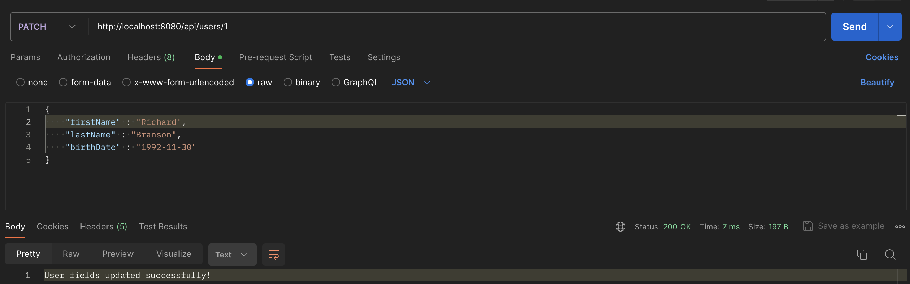
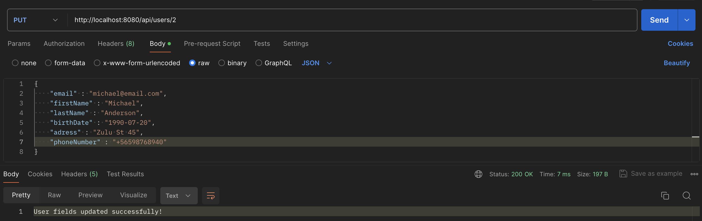
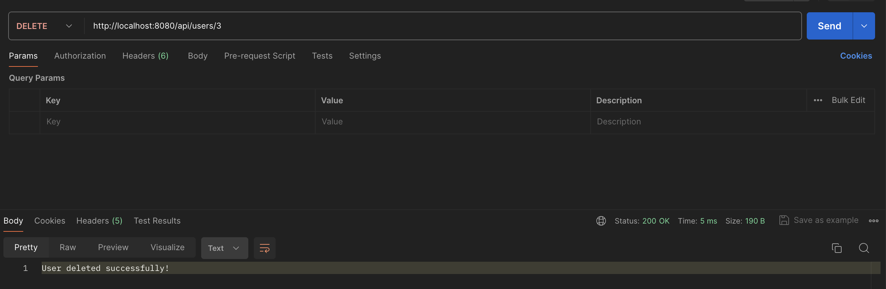
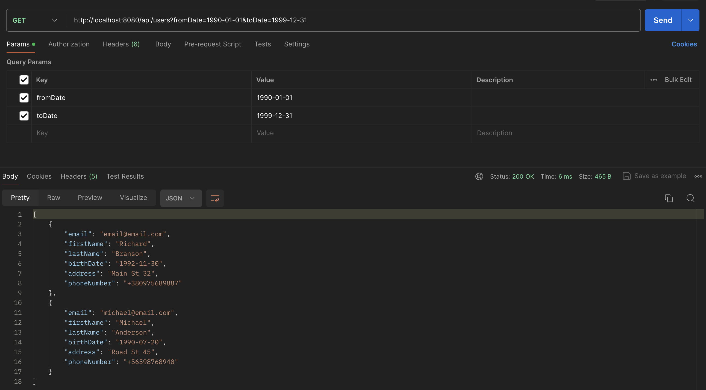

### Features
- Includes a controller implementation for the "Users" resource, in accordance with RESTful API requirements.
- All API operations, including user creation, updating, deletion, and searching, are covered by tests using the Spring Framework.
- Error handling for the RESTful API is implemented to provide clear and informative responses.
- The API returns data in JSON format, adhering to RESTful API standards.

### Requirements
- Any version of Spring Boot, at your discretion.
- Java version of your choice.
- Database usage is not required, as the data persistence layer is not implemented.
- The project is created using Spring Initializr.

### Getting Started
To run the project, follow these steps:

1. Clone the repository: `git clone <https://github.com/MACaron99/user-management-api.git>`
2. Open the project in your preferred IDE.
3. Build the project using Maven.
4. Run the application.

### Endpoints
- **Create User**: `POST /api/users`
  - This endpoint allows you to register users who are more than 18 years old. The age restriction is defined in the properties file.
- **Update User**: `PATCH /api/users/{id}`
  - Update one or more fields of a user identified by their ID.
- **Update All User Fields**: `PUT /api/users/{id}`
  - Update all fields of a user identified by their ID.
- **Delete User**: `DELETE /api/users/{id}`
  - Delete a user by their ID.
- **Search Users by Birth Date Range**: `GET /api/users?from={from_date}&to={to_date}`
  - Retrieve a list of users within the specified birth date range. The "from" date should be earlier than the "to" date.

### Screenshots

#### Create User

---

#### Update One/Some User Fields

---

#### Update All User Fields

---

#### Delete User

---

#### Get Users by Birth Date Range

---

### Testing
The project is equipped with comprehensive unit tests for each service method, employing JUnit. To run these tests, simply navigate to the src/test/java directory and execute the corresponding test classes. These tests validate the functionality of individual components, ensuring they perform as expected under various conditions.

### Error Handling
When interacting with the API, various types of errors may occur, and each is handled appropriately. Below are the categories of errors and their respective handling mechanisms:
- **EmailRequiredException**:
  - Occurs when attempting to create a user without specifying an email.
  - Handling: Returns an HTTP status code 400 (Bad Request) with a message indicating the need to provide an email.
- **BirthDateRequiredException**:
  - Thrown if attempting to create a user without specifying a birth date.
  - Handling: Returns an HTTP status code 400 (Bad Request) with a message indicating the need to specify a birth date.
- **FirstNameRequiredException**:
  - Occurs when attempting to create a user without specifying a first name.
  - Handling: Returns an HTTP status code 400 (Bad Request) with a message indicating the need to specify a first name.
- **LastNameRequiredException**:
  - Thrown if attempting to create a user without specifying a last name.
  - Handling: Returns an HTTP status code 400 (Bad Request) with a message indicating the need to specify a last name.
- **InvalidBirthDateException**:
  - Occurs when the specified birth date of the user is later than the current date.
  - Handling: Returns an HTTP status code 400 (Bad Request) with a message indicating the invalidity of specifying a future date as the birth date.
- **UserAgeInsufficientException**:
  - Thrown if the user's specified birth date indicates they are under 18 years old.
  - Handling: Returns an HTTP status code 400 (Bad Request) with a message indicating that the user must be over 18 years old.
- **InvalidEmailException**:
  - Occurs when an invalid email is provided for the user.
  - Handling: Returns an HTTP status code 400 (Bad Request) with a message indicating the incorrect email format.
- **InvalidDateRangeException**:
  - Thrown if attempting to retrieve users using an invalid date range.
  - Handling: Returns an HTTP status code 400 (Bad Request) with a message indicating the invalid date range.
- **UserNotFoundException**:
  - Triggered when a user with the specified ID cannot be found, such as during an update or delete operation.
  - Handling: Returns an HTTP status code 404 (Not Found) along with a message indicating that the user with the specified ID was not found.

### Dependencies
The project utilizes the following dependencies:
- **Spring Boot Starter Web**: Enables the building of web applications using Spring MVC..
- **Spring Boot Starter Test**: Facilitates testing of Spring Boot applications.

### Java Version
The project is implemented using Java version 17.

### Spring Boot Version
The project is built on Spring Boot version 3.2.5.

### License
This project is licensed under the MIT License. See the [LICENSE](LICENSE) file for details.

---

**Developed by Artem Makarenko in 2024.**
